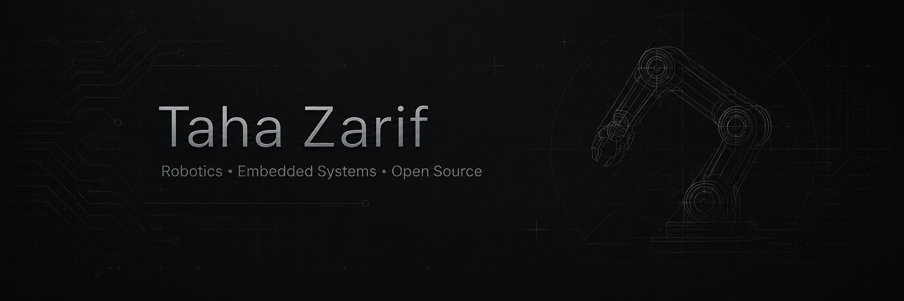

  

I like building things that **move, sense and react** — and I like figuring out what went wrong when they don't.

I'm exploring robotics, embedded systems and real-time software through hands-on projects, debugging and open-source work.

Most of the time you'll find me somewhere between **software and hardware**, working with C++, Python and microcontrollers.

---

### What interests me

- 🤖 Robotics and simulation
- ⚙️ Embedded systems and microcontrollers
- 🎛️ Control and real-time systems
- 🔍 Debugging and root-cause analysis
- 🧪 Reproducible tests and edge cases
- 🌍 Open-source development

### Tools I work with

`C++` · `Python` · `Arduino` · `Git` · `Linux`

---

### How I like to work

I enjoy taking a problem apart until I understand **why** it happens, not just how to make it disappear.

When I run into a bug, my first questions are usually:

> Can I reproduce it?  
> Can I isolate it?  
> Can I turn it into a test?

I'm currently getting deeper into open source by reading the code behind issues, testing assumptions and contributing focused technical feedback.

---

### Currently

- building small robotics and embedded experiments
- learning more about simulation and control
- improving my C++ and Python
- working toward more code contributions and pull requests

---

If you're working on something around robotics or embedded systems and there's an interesting technical problem to dig into, I'm always curious.
